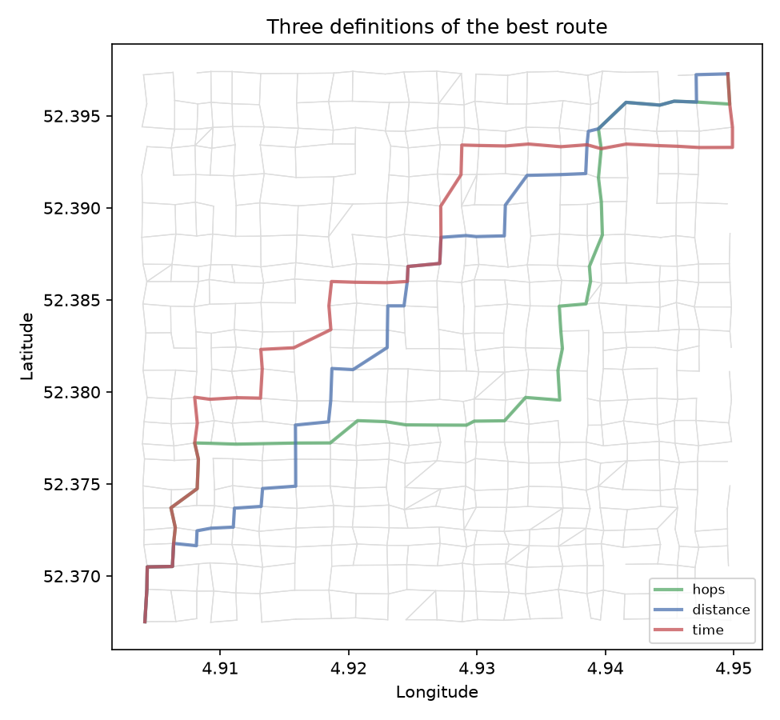
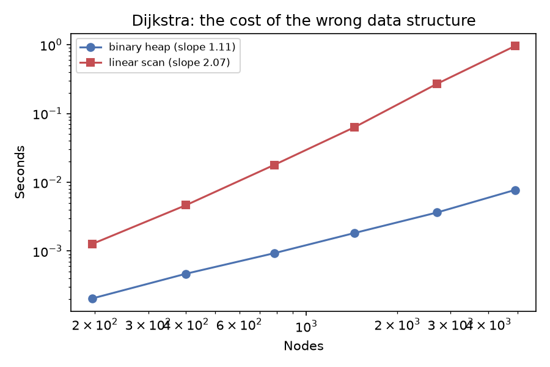

# Graph algorithms on a city


Traversal, shortest paths, betweenness centrality and state-space search, implemented
from scratch and measured on a generated street network of 576 junctions. NetworkX
appears only as the reference the tests check against.

```bash
pip install -e ".[dev]"
pytest -q                 # 33 tests, including cross-checks against NetworkX
python -m graphlab.study  # every experiment, writes reports/
```

## There is no such thing as the best route

The same trip, under three definitions of "best":

| Optimising | Turns | Metres | Seconds |
| --- | --- | --- | --- |
| Fewest turns | 41 | 6,080 | 648 |
| Shortest | 43 | 5,939 | 639 |
| Quickest | 43 | 6,182 | 584 |



The quickest route is **242 m longer and 55 seconds faster** than the shortest one, and
the two share only **9% of their streets**. Same graph, same junctions, same algorithm —
the answer is decided entirely by what goes into the weight. That is the whole argument
for separating the algorithm from the cost function, and the reason a routing app asks
whether you want fastest or shortest before it asks anything else.

## A heuristic is free information

| Algorithm | Nodes expanded | Route length |
| --- | --- | --- |
| Dijkstra | 575 | 5,939 m |
| A* with straight-line distance | 490 | 5,939 m |

Identical answer, 15% less work. The heuristic must be *admissible* — never an
overestimate — and straight-line distance qualifies because no road is shorter than the
straight line. Drop that property and A* gets faster still and stops being correct.

## The data structure is the algorithm

Dijkstra twice: once with a binary heap, once picking the next node by linear scan.

| Nodes | Edges | Binary heap | Linear scan | Ratio |
| --- | --- | --- | --- | --- |
| 400 | 1,386 | 0.0005 s | 0.0046 s | 10× |
| 1,442 | 5,024 | 0.0018 s | 0.0631 s | 35× |
| 2,702 | 9,614 | 0.0036 s | 0.2699 s | 74× |
| 4,899 | 17,592 | 0.0077 s | 0.9596 s | **124×** |



Fitted growth exponents: **1.11** for the heap and **2.07** for the linear scan, against
the O(m log n) and O(n²) that theory predicts on a sparse graph. Same algorithm, same
answers, one line of difference in how the next node is chosen — and a gap that widens
with every node added.

## Searching a space nobody built

The 8-puzzle has 181,440 reachable states, generated as the search reaches them.

| Optimal moves | BFS expanded | Bidirectional | Speed-up | Same answer |
| --- | --- | --- | --- | --- |
| 16 | 7,156 | 306 | 23× | yes |
| 20 | 30,297 | 788 | 38× | yes |
| 22 | 75,178 | 1,453 | 52× | yes |
| 24 | 100,290 | 2,023 | 50× | yes |

A breadth-first frontier grows like bᵈ, so two searches of depth d/2 cost the square
root of one search of depth d — and the saving grows with difficulty, exactly as the
exponent says. Both return the same optimal move count every time: this buys work, not
quality. It needs the goal known in advance and reversible moves, which is why it isn't
the default everywhere.

## Which streets does the city depend on?

Betweenness centrality — the share of shortest paths running through a junction —
computed by Brandes' algorithm in O(nm + n² log n) instead of the O(n³) the definition
implies. The streets that come top are not the longest or the fastest; they are the ones
with no substitute.

## What's here

```
src/graphlab/
  graph.py          adjacency-list weighted digraph, haversine, three edge weights
  city.py           the generated street network: uneven blocks, arterials, diagonals
  traversal.py      BFS, iterative DFS, components, three-colour cycle detection, Kahn
  shortest_path.py  Dijkstra (heap and linear scan), A*, Bellman-Ford
  centrality.py     Brandes betweenness, weighted and unweighted
  statespace.py     8-puzzle, BFS and bidirectional BFS
  benchmark.py      timing harness and log-log exponent fitting
  study.py          runs everything, writes the report
```

Details that are there for a reason, each with a test:

- **Cycle detection uses three colours, not a visited set.** An edge into a node already
  finished is a second route, not a loop; a visited set calls a diamond a cycle.
- **DFS is iterative.** Recursion dies on a graph of any depth — there's a 3,000-node
  test that would fail otherwise.
- **Dijkstra leaves stale heap entries in and skips them on the way out**, because a
  binary heap cannot decrease a key cheaply.
- **Bellman-Ford reports a negative cycle** rather than returning a number that means
  nothing, and stops early when a round changes nothing.
- **Puzzle scrambles walk backwards from the goal.** Half of all tile arrangements are
  unreachable; shuffling at random would produce unsolvable puzzles half the time.

## Limitations

- The city is generated, not Amsterdam. OpenStreetMap extracts aren't redistributable
  here and Overpass isn't always reachable. The structure is plausible and the
  coordinates are real geography, but the streets are invented.
- Timings are from one machine and one Python build: the exponents transfer, the seconds
  don't.
- No arc flags, no contraction hierarchies, none of what a production routing engine
  does to answer in microseconds.

## Provenance

Rebuilt from my Algorithms and Data Structures coursework (BSc Business Analytics,
University of Amsterdam), which implemented graph search over a state space, shortest
paths on an Amsterdam street extract under three different weightings, and cycle
detection in a decision tree. Those were auto-graded submissions on the course's
scaffolding and its data; this is my own rewrite, with the benchmarks, the centrality,
the bidirectional search and the tests added.
