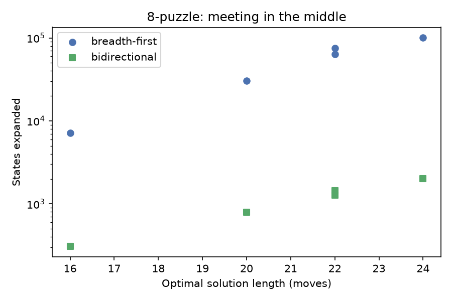

# Graph algorithms on a city

Generated 2026-09-25 by `python -m graphlab.study`. Graph: 575 junctions, 1988 directed street segments, generated (see `city.py`) because street extracts cannot be redistributed here.

## 1. There is no such thing as the best route

| Optimising | Turns | Metres | Seconds |
| --- | --- | --- | --- |
| hops | 41 | 6,079 | 648 |
| distance | 43 | 5,939 | 639 |
| time | 43 | 6,182 | 584 |

The quickest route is 242 m longer than the shortest one (4.1%) and arrives 55 seconds sooner (8.7% quicker). The routes share only 9% of their streets. Same graph, same pair of junctions, same algorithm - the answer is set entirely by what you put in the weight.

## 2. A heuristic is free information

| Algorithm | Nodes expanded | Route length (m) |
| --- | --- | --- |
| Dijkstra | 575 | 5,939 |
| A* with straight-line distance | 490 | 5,939 |

A* reaches the identical answer while expanding 15% fewer nodes. The heuristic has to be admissible - never an overestimate - and the straight-line distance qualifies because no road is shorter than the straight line. Drop that property and A* gets faster still and stops being correct, which is the trade every routing engine has to decide on.

## 3. Which streets does the city depend on?

Betweenness centrality: the share of shortest paths that run through a junction. Brandes' algorithm computes it in O(nm + n² log n) rather than the O(n³) the definition suggests.

| Street | Betweenness |
| --- | --- |
| West Weg 501 | 0.1246 |
| Noord Gracht 459 | 0.1139 |
| Oude Plein 504 | 0.1078 |
| Noord Singel 499 | 0.1032 |
| Oost Dijk 570 | 0.0986 |
| Oost Kade 618 | 0.0977 |
| Oude Straat 231 | 0.0970 |
| Zuid Gracht 608 | 0.0962 |

These are not the longest streets or the fastest. They are the ones with no substitute: close one and traffic has nowhere equivalent to go.

## 4. The data structure is the algorithm

| Nodes | Edges | Binary heap (s) | Linear scan (s) | Ratio |
| --- | --- | --- | --- | --- |
| 196 | 658 | 0.0002 | 0.0013 | 6.2x |
| 400 | 1386 | 0.0005 | 0.0046 | 9.9x |
| 783 | 2736 | 0.0009 | 0.0179 | 19.2x |
| 1442 | 5024 | 0.0018 | 0.0631 | 34.6x |
| 2702 | 9614 | 0.0036 | 0.2699 | 74.4x |
| 4899 | 17592 | 0.0077 | 0.9596 | 124.1x |

Fitted growth exponents: **1.11** for the heap and **2.07** for the linear scan, against the O(m log n) and O(n²) the theory predicts on a sparse graph. Same algorithm, same answers; one line of difference in how the next node is chosen.

## 5. Searching a space nobody built

The 8-puzzle has 181,440 reachable states. They are generated as the search reaches them - the graph never exists in memory, which is the only way state-space search works at any real scale.

| Optimal moves | BFS states expanded | Bidirectional | Speed-up | Same answer |
| --- | --- | --- | --- | --- |
| 22 | 63,242 | 1,276 | 49.6x | yes |
| 20 | 30,297 | 788 | 38.4x | yes |
| 16 | 7,156 | 306 | 23.4x | yes |
| 24 | 100,290 | 2,023 | 49.6x | yes |
| 22 | 75,178 | 1,453 | 51.7x | yes |

A breadth-first frontier grows like b^d, so two searches of depth d/2 cost the square root of one search of depth d. Both return the same optimal move count on every puzzle here - the saving is in work, not in quality. It needs the goal known in advance and reversible moves, which is why it is not the default everywhere.

## Limitations

- The city is generated. Its structure is plausible and its geometry is real latitude and longitude, but it is not Amsterdam.
- Timings come from one machine and one Python build; the exponents transfer, the seconds do not.
- These implementations are for understanding: no arc flags, no contraction hierarchies, none of what a production routing engine does to answer in microseconds.